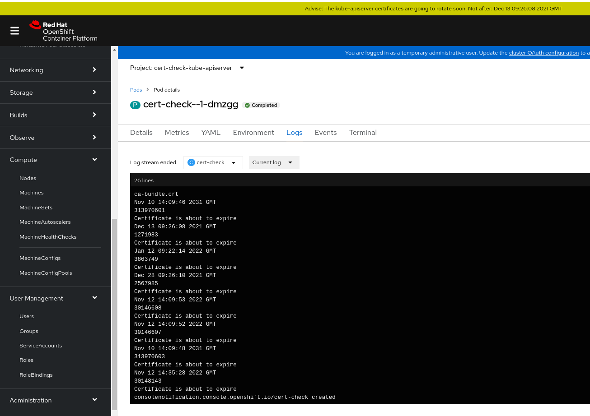

# CERT-CHECK

This repo contains a script to check if the ca-bundle.crt from the configmap/client-ca at openshift-kube-apiserver namespace have certificates near to expire, and create a ConsoleNotification warning about it. When the renew of certificates occurs, the pods of kube-apiserver are going to rollout, so with this script we are aware about when it's going to happen.

## Install

To install it you need to be clusteradmin, create the namespace and deploy the manifests:

```
oc new-project cert-check-kube-apiserver
oc apply -f manifests/
```

With that, you will have a cronJob who every day will check with the script from the configmap the time to live of each certificate in the ca-bundle.crt




## Config tasks

You can run on demand creating a job from the cronJob:
```
oc create job --from=cronjob/cert-check cert-check -n cert-check-kube-apiserver
```

Or edit the **cert-check&#46;sh**, in that case you will need to redeploy as configmap with:
```
oc delete configmap cert-check-script -n cert-check-kube-apiserver
oc create configmap cert-check-script --from-file cert-check.sh -n cert-check-kube-apiserver
```